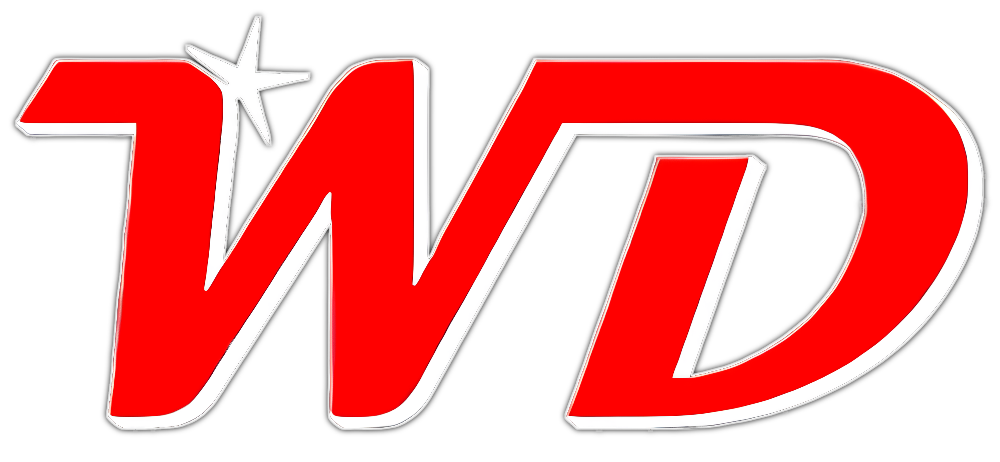
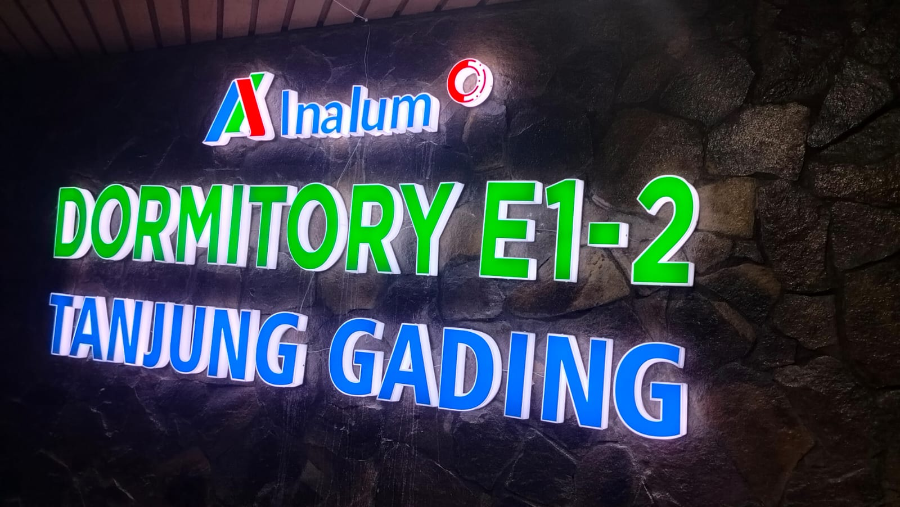
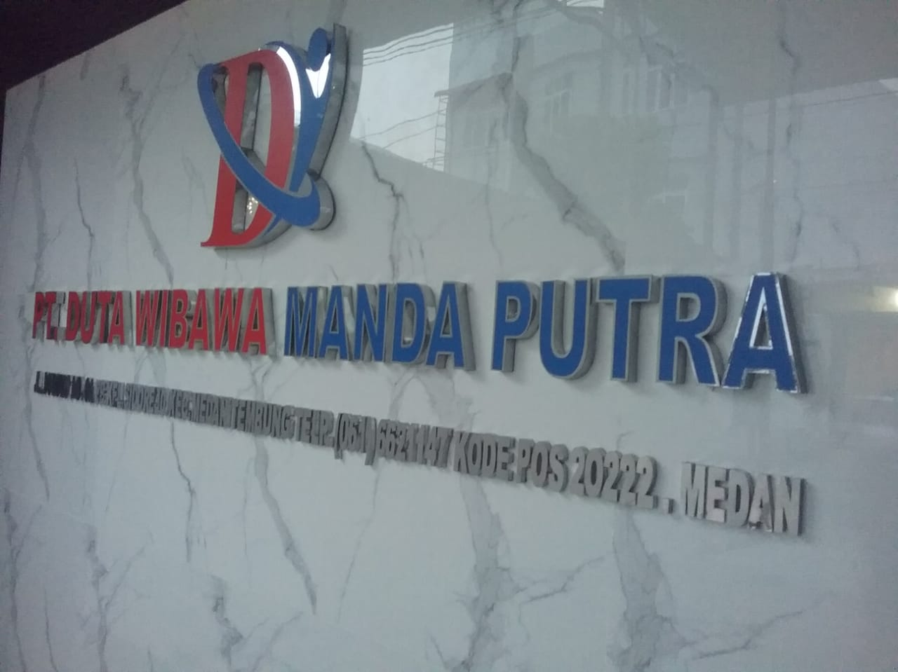
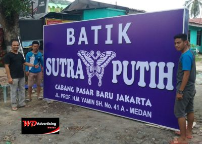

<!DOCTYPE html>
<html lang="id">
<head>
  <meta charset="UTF-8" />
  <meta name="viewport" content="width=device-width, initial-scale=1.0"/>
  <title>Huruf Acrylik Stainless Murah Medan</title>
  <link rel="icon" type="image/png" href="logo.png" />
  <link href="https://cdn.jsdelivr.net/npm/bootstrap@5.3.0/dist/css/bootstrap.min.css" rel="stylesheet"/>
  <link href="https://cdnjs.cloudflare.com/ajax/libs/font-awesome/6.4.0/css/all.min.css" rel="stylesheet"/>

  
</head>
<body>

  <!-- Header -->
  

    

      
      

        <h1>ADVERTISING</h1>
        
Specialist Huruf Timbul Medan

      

    

  

  <!-- Navigasi -->
  <nav class="navbar navbar-expand-lg" style="background-color: #ff0000;">
    

      <button class="navbar-toggler" type="button" data-bs-toggle="collapse" data-bs-target="#navbarNav">
        
      </button>
      

        <ul class="navbar-nav mx-auto">
          <li class="nav-item dropdown">
            <a class="nav-link dropdown-toggle" href="#" role="button" data-bs-toggle="dropdown">
              <i class="fas fa-home"></i>Home
            </a>
            <ul class="dropdown-menu">
          <li><a class="dropdown-item" href="#profil-singkat">Profil Singkat</a></li>
          <li><a class="dropdown-item" href="#hubungi-kami">Hubungi Kami</a></li>
            </ul>
          </li>

  <li class="nav-item dropdown">
  <a class="nav-link dropdown-toggle" href="#" role="button" data-bs-toggle="dropdown">
  <i class="fas fa-box"></i> Produk</a>
      <ul class="dropdown-menu">
          <li><a class="dropdown-item" href="akrilik.html">Huruf Timbul Acrylik</a></li>
          <li><a class="dropdown-item" href="stainlis.html">Huruf Timbul Stainlees</a></li>
          <li><a class="dropdown-item" href="galvanil.html">Huruf Timbul Galvanil</a></li>
          <li><a class="dropdown-item" href="neonbox.html">Neon Box</a></li>
          <li><a class="dropdown-item" href="prasasti.html">Prasasti</a></li>
      </ul>

    </li>
          <li class="nav-item"><a class="nav-link" href="galeri.html"><i class="fas fa-images"></i> Galeri</a></li>
           <li class="nav-item dropdown">
           <a class="nav-link dropdown-toggle" href="#" role="button" data-bs-toggle="dropdown">
           <i class="fas fa-share-alt"></i>Sosial Media</a>
           <ul class="dropdown-menu">
           <li><a class="dropdown-item" href="sosialmedia.html">Sosial Media Kami</a></li>
           </ul>
        </ul>
      

    

  </nav>

  
    
    Selamat Datang di CV. WD Advertising — Mitra terpercaya untuk kebutuhan huruf timbul Anda. 
    Siap membantu memperindah tampilan bisnis, Toko, kantor, pusat perbelanjaan, kafe, rumah sakit, hingga proyek besar seperti ikon desa maupun kota dengan hasil yang rapi dan tahan lama.
  

  <!-- Slide Foto -->
  

  

      

        
      

      

        
      

       

        
      

       

        
      

       

        
      

    

    <button class="carousel-control-prev" type="button" data-bs-target="#carouselExampleIndicators" data-bs-slide="prev">
    
  </button>
  <button class="carousel-control-next" type="button" data-bs-target="#carouselExampleIndicators" data-bs-slide="next">
    
  </button>

<!-- Jenis Produk dengan Transisi -->
<section id="jenis-produk" class="container my-5">
  <h3 class="mb-4 section-title">
    <i class="fas fa-box"></i> Jenis Produk Kami
  </h3>
  
  

    <!-- Produk 1 -->
    

      

        
        

          <h4>Huruf Timbul Acrylik</h4>
          
Material ringan dengan berbagai warna dan finishing glossy/matt

          <a href="akrilik.html" class="btn btn-outline-light">Lihat Detail</a>
        

      

    

    <!-- Produk 2 -->
    

      

        
        

          <h4>Huruf Timbul Stainless</h4>
          
Tahan karat dengan tampilan elegan dan modern

          <a href="stainlis.html" class="btn btn-outline-light">Lihat Detail</a>
        

      

    

    <!-- Produk 3 -->
    

      

        
        

          <h4>Huruf Timbul Galvanil</h4>
          
Material kuat cocok untuk outdoor dengan harga terjangkau

          <a href="galvanil.html" class="btn btn-outline-light">Lihat Detail</a>
        

      

    

    <!-- Produk 4 -->
    

      

        
        

          <h4>Neon Box</h4>
          
Pencahayaan LED yang menarik untuk branding toko

          <a href="neonbox.html" class="btn btn-outline-light">Lihat Detail</a>
        

      

    

    <!-- Produk 5 -->
    

      

        
        

          <h4>Prasasti</h4>
          
Plakat dan tanda penghargaan dengan berbagai material

          <a href="prasasti.html" class="btn btn-outline-light">Lihat Detail</a>
        

      

    

  

</section>

<!-- CSS Produk -->

 <section id="profil-singkat" class="profil-singkat container my-5">
  

    <!-- Teks Profil -->
    

      <h3 class="mb-1">Profil Singkat</h3>
       

        CV. WD ADVERTISING MEDAN merupakan perusahaan profesional yang telah berdiri sejak tahun 2010, dan telah menjadi pilihan utama dalam bidang pembuatan huruf timbul di Kota Medan dan sekitarnya. Kami melayani berbagai kebutuhan branding visual—mulai dari huruf timbul yang digunakan pada kantor, pusat perbelanjaan, toko, kafe, rumah sakit, hingga proyek besar seperti ikon desa maupun kota.  
        Dengan pengalaman lebih dari 15 tahun, kami telah dipercaya untuk menangani proyek di seluruh wilayah Provinsi Sumatera Utara. Kami juga melayani pemesanan secara online, sehingga pelanggan dari luar daerah tetap bisa mendapatkan layanan terbaik dari kami dengan mudah dan aman.  
      

    

  

</section>

  <!-- Interactive Location Card -->
  

    

      

        <i class="fas fa-map-marker-alt"></i>
      

      

        <h4>Kunjungi Workshop Kami</h4>
        
Jl. Madiosantoso No.199, Medan Timur

        
          <i class="fas fa-external-link-alt"></i> Klik untuk lihat peta
        
      

      

        <i class="fas fa-chevron-right"></i>
      

    

  

  <!-- Location Modal -->
  

    

    

      

        <h4><i class="fas fa-map-marker-alt"></i> Lokasi CV. WD Advertising</h4>
        <button type="button" class="btn-close" onclick="closeLocationModal()" style="filter: invert(1);"></button>
      

      

        

          <iframe 
            src="https://www.google.com/maps/embed?pb=!1m18!1m12!1m3!1d3982.038805904658!2d98.67205731475454!3d3.597562497366!2m3!1f0!2f0!3f0!3m2!1i1024!2i768!4f13.1!3m3!1m2!1s0x303131c9fd521f7f%3A0x5763f1a6b6c4c4e5!2sJl.%20Madio%20Santoso%2C%20Pulo%20Brayan%20Darat%20I%2C%20Kec.%20Medan%20Tim.%2C%20Kota%20Medan%2C%20Sumatera%20Utara!5e0!3m2!1sid!2sid!4v1700000000000!5m2!1sid!2sid"
            width="100%" 
            height="450" 
            style="border:0;" 
            allowfullscreen="" 
            loading="lazy" 
            referrerpolicy="no-referrer-when-downgrade">
          </iframe>
        

        

          
<strong>Alamat Lengkap:</strong>

          
Jl. Madiosantoso No.199 Lk.XIV Kel. Pulo Brayan darat I Kec. Medan Timur

          
<strong>Kontak:</strong> 0813 9999 2528

        

  

    

      

        <a href="https://www.facebook.com/bonan.saputrahasibuan?locale=id_ID" target="_blank" class="social-link">
          <i class="fab fa-facebook social-icon"></i>
          
Facebook

          
Bonan Saputra Hasibuan

        </a>
      

      

        <a href="https://instagram.com" target="_blank" class="social-link">
          <i class="fab fa-instagram social-icon"></i>
          
Instagram

          
wd.advertising

        </a>
      

      

        <a href="https://youtube.com" target="_blank" class="social-link">
          <i class="fab fa-youtube social-icon"></i>
          
YouTube

          
WD Advertising

        </a>
      

      

        <a href="https://wa.me/6281234567890" target="_blank" class="social-link">
          <i class="fab fa-whatsapp social-icon"></i>
          
WhatsApp

          
Chat Sekarang

        </a>
      

    

    <!-- Hubungi Kami Section moved below social media logos -->
    <section id="hubungi-kami" class="container my-5" style="margin-top: 60px !important;">
      <h3 class="mb-3">Hubungi Kami</h3>
      

        Untuk informasi lebih lanjut dan pemesanan, silakan ikuti akun media sosial kami dan hubungi di nomor 0813 9999 2528 atau kunjungi di Jl. Madiosantoso No.199 Lk.XIV Kel. Pulo Brayan darat I Kec. Medan Timur.
      

    </section>
  

</section>

  <!-- Footer -->
  <footer>
    
&copy; 2025 Cv. Wd Advertising | Jalan Madio Santoso No. 199, Medan Timur

    
Email: wdadvertising@deliserdangkab.go.id | IG: @Wd.ADVERTISING MEDAN

  </footer>

  <!-- Script Bootstrap & Animasi Scroll -->
  
  
</body>
</html>
